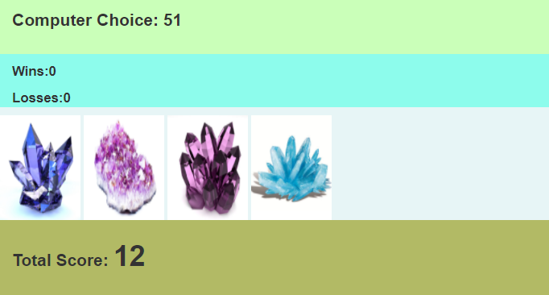

# Four Crystals

 
 
 
There are four crystals displayed as buttons on the page.

The player will be shown a random number at the start of the game.

When the player clicks on a crystal, it will add a specific amount of points to the player's total score.

When player clicks a crystal, the player's score counter is going to be updated.

 

The player wins if their total score matches the random number from the beginning of the game.

The player loses if their score goes above the random number.

The game restarts whenever the player wins or loses.

When the game begins again, the player sees a new random number. Also, all the crystals will have four new hidden values. The user's score (and score counter) will reset to zero.

 
 
The app shows the number of games the player wins and loses.
